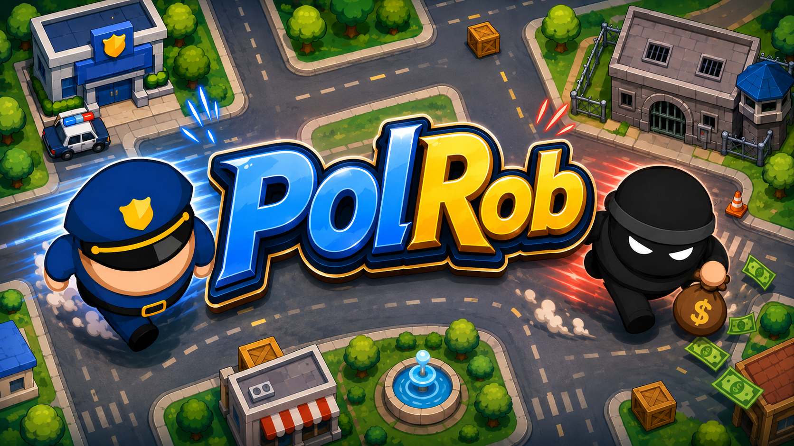

# 서신우

C#과 .NET 생태계를 기반으로 웹 애플리케이션부터 모바일 앱/게임 개발을 진행한 경험이 있습니다.  
단순히 코드를 짜는 것을 넘어, 사람들에게 즐거움을 줄 수 있는 가치 있는 제품을 만드는 것이 목표입니다.

---

## 🛠 Tech Stack

**Languages & Frameworks**

  
  
  
  
  

**Graphics & Database & Infrastructure**

  
  
  

---

## 🚀 Projects

 

[**→ PolRob 자세히 보기**](https://github.com/seoshinwoo/polrob)

 

---

 

[**→ CanvaSync 자세히 보기**](https://github.com/seoshinwoo/canvasync)

 

---

### 📫 Contact Me

* **Phone**: `010 4218 1567`
* **Email**: `seoshinwoo99@gmail.com`
